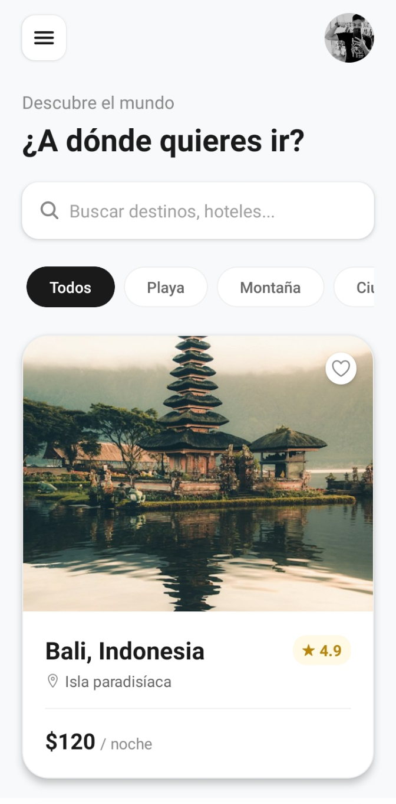
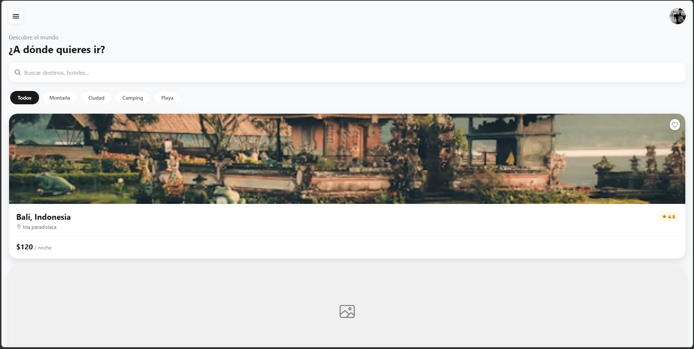

<h1 align="center">WanderLust 🌍</h1>

> Una aplicación móvil de descubrimiento de destinos turísticos construida con React Native, Expo y TypeScript. Diseñada con arquitectura modular, componentes reutilizables y una experiencia de usuario fluida.

---

<p align="center">
  
  
  
  
  
</p>

<p align="center">
  
  
  
</p>

---

## 🖼️ Capturas de pantalla

### 📲 Vista móvil (app nativa)
<p align="center">
  
</p>

### 💻 Vista web (navegador)
<p align="center">
  
</p>

---

## ✨ Características principales

| Feature | Descripción |
|---------|-------------|
| 🏝️ **Exploración de destinos** | 16 destinos curados con imágenes reales de Unsplash |
| 🏷️ **Filtrado por categorías** | Playa, Montaña, Ciudad, Camping + "Todos" |
| 🔍 **Búsqueda en tiempo real** | Buscador con debounce preparado para API |
| ❤️ **Sistema de favoritos** | Hook `useFavorites` tipado listo para persistir |
| 🖼️ **Manejo robusto de imágenes** | Loading states, error fallback SVG, placeholders |
| 🎨 **Design System centralizado** | Tema único: colores, spacing, tipografía, sombras |
| 📦 **Arquitectura modular** | Componentes aislados, estilos co-localizados |
| 🔷 **TypeScript selectivo** | Solo donde aporta valor (props, hooks, tipos) |

---

## 🏗️ Arquitectura del proyecto

```
src/
├── components/           # Componentes UI reutilizables
│   ├── DestinationCard/  # 🎯 TypeScript - Tarjeta principal con interfaces
│   ├── Header/           # Barra superior con avatar y menú
│   ├── SearchBar/        # Buscador con icono y placeholder
│   ├── CategoryFilter/   # Scroll horizontal de chips filtrantes
│   └── index.js          # Barrel export
├── data/
│   └── destinations.js   # Datos mock + helpers de filtrado
├── hooks/
│   ├── useFavorites.ts   # 🎯 TypeScript - Estado de favoritos tipado
│   └── index.ts
├── screens/
│   └── HomeScreen/       # Pantalla principal compose
├── styles/
│   ├── theme.js          # 🎨 Design System (colores, spacing, radius, shadows)
│   ├── global.js         # Estilos base globales
│   └── index.js
└── utils/
    └── helpers.js        # Utilidades puras (formatPrice, debounce, etc.)
```

### Flujo de datos

```mermaid
graph TD
    A[HomeScreen] --> B[CategoryFilter]
    A --> C[SearchBar]
    A --> D[DestinationCard[]]
    B -->|onCategoryPress| A
    C -->|onChangeText| A
    D -->|onFavoritePress| E[useFavorites Hook]
    F[theme.js] -.-> A
    F -.-> B
    F -.-> C
    F -.-> D
```

---

## 🚀 Inicio rápido

### Prerrequisitos

- Node.js 18+
- npm / yarn / pnpm
- Expo CLI: `npm install -g @expo/cli`
- Dispositivo físico con **Expo Go** o emulador iOS/Android

### Instalación

```bash
# Clonar repositorio
git clone https://github.com/tu-usuario/wanderlust-rn.git
cd wanderlust-rn

# Instalar dependencias
npm install

# Iniciar servidor de desarrollo
npx expo start --clear
```

### Ejecutar en plataforma

```bash
# iOS (requiere macOS + Xcode)
npm run ios

# Android (requiere Android Studio)
npm run android

# Web
npm run web
```

---

## 🎨 Design System

El tema centralizado en `src/styles/theme.js` expone:

```typescript
theme = {
  colors: {        // 17 tokens de color semánticos
    primary, secondary, background, white,
    text, textSecondary, textMuted, placeholder,
    border, borderLight, cardShadow,
    favorite, ratingBg, buttonBg, buttonActiveBg
  },
  spacing: {       // 6 escalas (xs → xxl)
    xs: 4, sm: 8, md: 15, lg: 20, xl: 25, xxl: 30
  },
  borderRadius: {  // 6 escalas + round/pill
    sm: 12, md: 15, lg: 20, xl: 24, round: 20, pill: 20
  },
  fontSize: {      // 6 escalas
    xs: 12, sm: 14, md: 16, lg: 20, xl: 22, xxl: 28
  },
  fontWeight: { normal, medium, bold },
  shadows: {       // 4 elevaciones + heart
    sm, md, lg, heart
  }
}
```

**Uso:**
```javascript
import { theme } from '@/styles';

const styles = StyleSheet.create({
  card: {
    backgroundColor: theme.colors.white,
    borderRadius: theme.borderRadius.xl,
    padding: theme.spacing.lg,
    ...theme.shadows.lg,
  }
});
```

---

## 🧩 Componentes principales

### `DestinationCard` (TypeScript)

```tsx
interface DestinationCardProps {
  title: string;
  location: string;
  price: number;
  rating: number;
  imageUri: string;
  isFavorite?: boolean;
  onPress?: () => void;
  onFavoritePress?: () => void;
}
```

**Estados visuales:**
- ✅ Imagen cargada → Foto real (cover)
- ⏳ Cargando → Icono `image-outline` centrado
- ❌ Error → Placeholder SVG "Imagen no disponible" + icono grande

### `CategoryFilter`

Scroll horizontal con chips activos/inactivos. Props:
```tsx
interface CategoryFilterProps {
  categories?: string[];
  activeIndex?: number;
  onCategoryPress?: (index: number) => void;
}
```

### `SearchBar`

Input controlado con icono de búsqueda. Props:
```tsx
interface SearchBarProps {
  placeholder?: string;
  onChangeText?: (text: string) => void;
  value?: string;
  onSubmit?: () => void;
}
```

### `useFavorites` (TypeScript)

```tsx
interface FavoriteItem {
  id: string;
  title: string;
  location: string;
  price: number;
  rating: number;
  imageUri: string;
}

const { favorites, toggleFavorite, isFavorite, count } = useFavorites();
```

---

## 📦 Scripts disponibles

| Comando | Descripción |
|---------|-------------|
| `npm start` | Inicia Expo Dev Server |
| `npm run ios` | Abre en simulador iOS |
| `npm run android` | Abre en emulador Android |
| `npm run web` | Abre en navegador |
| `npx tsc --noEmit` | Type-check sin emitir |

---

## 🔮 Roadmap / Próximos pasos

- [ ] **Persistencia real** - AsyncStorage / MMKV para favoritos
- [ ] **API real** - Integración con backend (Supabase, Firebase, REST)
- [ ] **Pantalla de detalle** - Navegación a `DestinationDetailScreen`
- [ ] **Filtros avanzados** - Precio, rating, distancia
- [ ] **Modo offline** - Cache de imágenes + Redux Persist / Zustand
- [ ] **Tests** - Jest + React Native Testing Library
- [ ] **CI/CD** - GitHub Actions + EAS Build
- [ ] **Internacionalización** - i18n (es/en)
- [ ] **Dark mode** - Tokens de tema extendidos
- [ ] **Animaciones** - Reanimated 3 / Moti

---

## 🤝 Contribuir

1. Fork del repo
2. Crea tu feature branch: `git checkout -b feature/nueva-funcionalidad`
3. Commit convencional: `git commit -m "feat: agregar filtro por precio"`
4. Push: `git push origin feature/nueva-funcionalidad`
5. Abre un Pull Request

### Estándares de código

- **TypeScript** en componentes nuevos con props complejas
- **JavaScript** para componentes simples, estilos, utils
- **ESLint + Prettier** (configurado en Expo)
- **Naming**: PascalCase componentes, camelCase hooks/utils, kebab-case archivos

---

## 📄 Licencia

MIT License - ver [LICENSE](LICENSE) para detalles.

---

## 🙏 Agradecimientos

- [Expo](https://expo.dev/) - Plataforma de desarrollo universal
- [Ionicons](https://ionic.io/ionicons) - Iconos hermosos y consistentes
- [Unsplash](https://unsplash.com/) - Fotografía libre de derechos
- [React Native Community](https://github.com/react-native-community) - Librerías esenciales

---

<p align="center">
  <strong>Hecho con ❤️ y React Native</strong><br>
  <sub>¿Te gustó? ¡Dale una ⭐ al repo!</sub>
</p>
